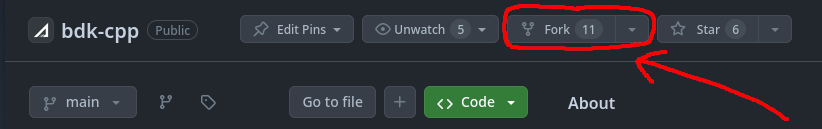

# Setting up the development environment

This subchapter explains how to set up AppLayer's BDK, our open-core blockchain SDK project, to start creating and deploying your contracts in it. This is an overview/"more approachable" version of the project's README.md file - be sure to read it as well.

You're able to tweak almost everything related to the BDK. We offer pre-existing solutions for all of those, but you are free to hack into them as you wish:

* Consensus
* Block processing
* Transaction processing
* Contract processing
* Communication between nodes, etc.

## Forking

Head over to the [GitHub repository](https://github.com/AppLayerLabs/bdk-cpp) and click the "Fork" button. After that, you can clone your forked repository with `git clone` and start developing on your own local blockchain.

<figure><figcaption><p>Go on and fork it!</p></figcaption></figure>

## Setup

You can setup the environment in two ways: _using Docker_, or _manually_. Manual setup has instructions for APT-based distros (e.g. Debian, Ubuntu, Mint, etc.), but other distros should work as long as you have all the dependencies installed.

### Docker (recommended)

Using the Docker image is the recommended way to develop on the BDK. It will ensure that you have the correct environment to build and deploy the network, without worrying about dependencies or which host distro you're using.

Fork the project and clone your forked repository:

```bash
# Clone your repository
git clone https://github.com/YOUR_USER_NAME/bdk-cpp.git
# Go to the project directory
cd bdk-cpp
# Switch to a branch for contract development on latest release (main branch)
git checkout -b contract-development main
```

Then, install Docker on your system (if you don't have it installed already). Instructions can be found at the links below:

* [Docker for Windows](https://docs.docker.com/docker-for-windows/install/)
* [Docker for Mac](https://docs.docker.com/docker-for-mac/install/)
* [Docker for Linux](https://docs.docker.com/desktop/install/linux-install/)

Once Docker is installed, go to the root directory of your cloned repository (where the `Dockerfile` is located), and run the following command (if you're on Linux or Mac, use `sudo`):

```bash
docker build -t bdk-cpp-dev:latest .
```

This will build the image and tag it as `bdk-cpp-dev:latest`. You can change the tag to whatever you want, but remember to change it at the next step.

After building the image, run it with the following command (again, if using Linux or Mac, run as `sudo`):

```bash
# For Linux/Mac
docker run -it -v $(pwd):/bdk-volume -p 8080-8099:8080-8099 -p 8110-8111:8110-8111 bdk-cpp-dev:latest
# For Windows
docker run -it -v %cd%:/bdk-volume -p 8080-8099:8080-8099 -p 8110-8111:8110-8111 bdk-cpp-dev:latest
```

where:

* `$(pwd)` or `%cd%` is the absolute/full path to your repository's folder
* `:/bdk-volume` is the path inside the container where the BDK will be mounted. This volume is synced with the `bdk-cpp` folder inside the container
* The `-p` flags expose the ports used by the nodes - the example exposes the default ports 8080-8099 and 8110-8111, if you happen to use different ports, change them accordingly

When running the container, you will be logged in as the root user and will be able to develop, build and deploy the network within the container. Remember that we are using our local repo as a volume, so every change in the local folder will be reflected to the container in real time, and vice-versa (so you can develop outside and use the container only for build and deploy). You can also integrate the container with your favorite IDE or editor.

#### VSCode + Docker extension

To integrate the container with VSCode, you need to install the [Docker extension](https://marketplace.visualstudio.com/items?itemName=ms-azuretools.vscode-docker) and configure it to use the container. After installing it, there is a `docker-compose.yml` file on the root of the repository that you can use to build and run the container. The only thing that you need to do is to change the `volumes` section to point to your local SDK folder:

```yaml
volumes:
  - /path/to/your/sdk:/orbitersdk-volume
```

After editing the `docker-compose.yml` file, right-click on it and select `Compose Up` to build and run the container so you can start developing on it. Click on the Docker extension icon on the left side of the VSCode window and you will see the container running. You can also right-click on the container and select `Attach Shell` to open a terminal on the container.

<figure><figcaption></figcaption></figure>

### Manual setup

You can follow these steps to build the BDK in your own system. Dependencies are:

* **GCC** with support for **C++23** or higher
* **CMake 3.19.0** or higher
* **Boost 1.83** or higher (components: _chrono, filesystem, program-options, system, thread, nowide_)
* **OpenSSL 1.1.1**
* **CryptoPP 8.2.0** or higher
* **libscrypt**
* **zlib**
* **libsnappy** for database compression
* **tmux** (for deploying)
* (optional) **clang-tidy** for linting
* (optional) **mold** for faster/more efficient linking

The versions of those dependencies should suffice out-of-the-box for at least the following distros (or greater, including their derivatives):

* **Debian 13 (Trixie)**
* **Ubuntu 24.04 LTS (Noble Numbat)**
* **Linux Mint 22 (Wilma)**
* **Fedora 40**
* Any rolling release distro from around **May 2024** onwards (check their repos to be sure)

For older distros, you may need to compile some dependencies from source (specifically CMake, Boost and/or GCC). Make sure to either uninstall them from the system first to prevent any version conflicts, or use a workaround like e.g. Debian's `update-alternatives` or similar.

Specifically for GCC, make sure to also export the right paths for compilation in your environment in case you're using a self-compiled build. For example, in a Linux system, put something like this in your `~/.bashrc` file, changing the version accordingly to whichever one you have installed:

```bash
PATH=/usr/local/gcc-14.1.0/bin:$PATH
LD_LIBRARY_PATH=/usr/local/gcc-14.1.0/lib64:$LD_LIBRARY_PATH
```

#### One-liners

* For APT-based distros:

```bash
sudo apt install build-essential cmake tmux clang-tidy autoconf libtool pkg-config libabsl-dev libboost-all-dev libc-ares-dev libcrypto++-dev libgrpc-dev libgrpc++-dev librocksdb-dev libscrypt-dev libsnappy-dev libssl-dev zlib1g-dev openssl protobuf-compiler protobuf-compiler-grpc unison git
```

## Compiling

After forking the project, you can now setup your own local testnet. This is strongly recommended, as it will ensure your environment is properly setup and that you are able to compile the project with your contracts in it.

Clone your forked repository by following the steps below:

```bash
# Clone your repository
git clone https://github.com/YOUR_USER_NAME/bdk-cpp.git
# Go to the project directory
cd bdk-cpp
# Switch to a branch for contract development on latest release (main branch)
git checkout -b contract-development main
```

After cloning, the following commands will build the project within the folder which `scripts/AIO-setup.sh` (a script that automatically deploys a local testnet) will use later.

```bash
# Create the folder and enter it
mkdir build_local_testnet && cd build_local_testnet
# Configure cmake (DEBUG=ON will enable debug symbols and address sanitizer)
cmake -DDEBUG=ON ..
# Build the project - you can use either one of the lines below
make -j$(nproc)
# or...
cmake --build . -- -j$(nproc)
```

After building, you can optionally run a test bench with the following command: `./src/bins/orbitersdkd-tests/orbitersdkd-tests -d yes` (the `-d yes` parameter will give a verbose output).

You can also use filter tags to test specific parts of the project (e.g. `./src/bins/orbitersdkd-tests/orbitersdkd-tests -d yes [utils]` will test all the components inside the `src/utils` folder, `[utils][tx]` will test only the transaction-related components inside utils, etc.). You can check all the available tags by doing a `grep -rw "\"\[.*\]\""` in the `tests` subfolder.

## Deploying

Currently there are two ways to deploy an AppLayer node: *manual*, and *dockerized*. Go back to the project's root folder and check the `scripts` subfolder - there are two main scripts there used for deploying the node. You can pick whichever one you prefer, depending on your needs.

### Dockerized deploy

You can deploy a node using Docker by running `./scripts/auto.sh`. Make sure you have both `docker` and `docker-compose` installed, as the script requires both to work. The script itself accepts several parameters. Running `./scripts/auto.sh help` will give you more info on each parameter.

### Manual deploy

To manually deploy a node, run `./scripts/AIO-setup.sh`. Make sure `tmux` is installed, as the script needs it to work. The script will create two folders at the project's root - `build_local_testnet` and `local_testnet` - and build and deploy a fresh new instance of a local testnet.

Running the script again will stop the testnet, rebuild it, replace it and restart it on the spot. If you wish to manually stop the testnet for some reason, run `tmux kill-server`. You can also read the script to find out the specific names of the tmux sessions to manually restart or stop accordingly.

Note that, when re-deploying, if your wallet or RPC client keeps track of account nonce data, you must reset it as a network reset would set back their nonces to 0. [Here's how to do it in MetaMask, for example](https://support.metamask.io/hc/en-us/articles/360015488891-How-to-clear-your-account-activity-reset-account).

You can use the following flags when calling the manual script to customize deployment:

| Flag            | Description                                      | Default Value     |
| --------------- | ------------------------------------------------ | ----------------- |
| --clean         | Clean the build folder before building           | false             |
| --no-deploy     | Only build the project, don't deploy the network | false             |
| --debug=\<bool> | Build in debug mode                              | true              |
| --cores=\<int>  | Number of cores to use for building              | Maximum available |

As an example, `./scripts/AIO-setup.sh --clean --no-deploy --debug=false --cores=4` will clean the build folder, only build the project, build in release mode and use 4 cores for building. Remember that GCC uses around 1.5GB of RAM per core, so we recommend adjusting the number of cores according to the available RAM on your system for more stability.

## MetaMask config

After deploying your node, you can configure and connect your preferred Web3 client/frontend to the network. We recommend using [Metamask](https://metamask.io) as it is the most popular one, but you're free to use any other client you wish.

As an example, here's how to configure MetaMask to connect to your local testnet:

| Field           | Value                                           |
| --------------- | ----------------------------------------------- |
| Network Name    | AppLayer Local Testnet                          |
| New RPC URL     | [http://127.0.0.1:8090](http://127.0.0.1:8090/) |
| Chain ID        | 808080                                          |
| Currency Symbol | APPL                                            |

<figure><figcaption></figcaption></figure>

Once you're connected, import the following private key for the chain owner account: `0xe89ef6409c467285bcae9f80ab1cfeb3487cfe61ab28fb7d36443e1daa0c2867`. This account contains 1000 APPL Tokens from the get go and is able to call the `ContractManager` contract.
